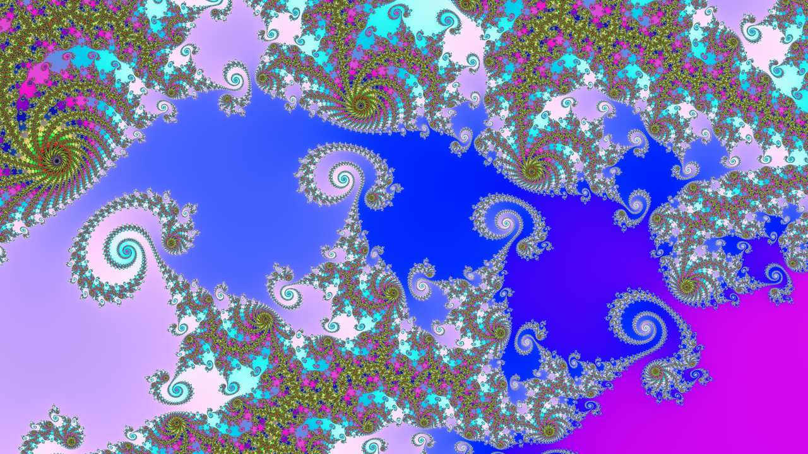
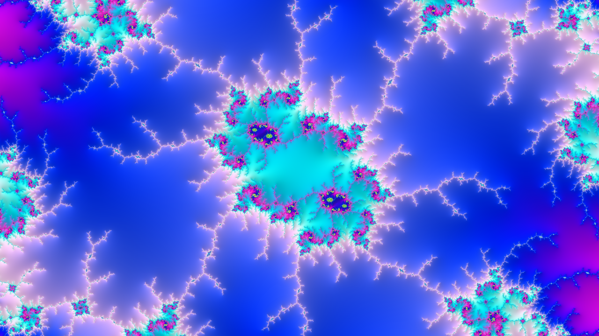
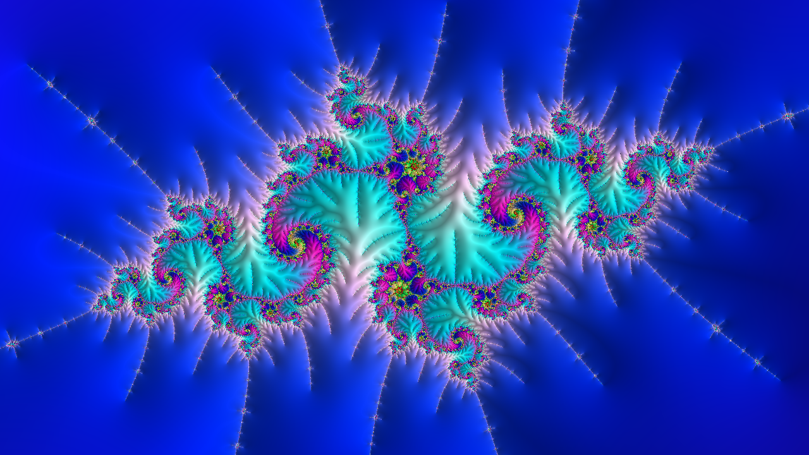

# Mandelbrot

En [mathématiques](https://fr.wikipedia.org/wiki/Math%C3%A9matiques), l'**ensemble de Mandelbrot** est une [fractale](https://fr.wikipedia.org/wiki/Fractale) définie comme l'[ensemble](https://fr.wikipedia.org/wiki/Ensemble) des points _c_ du [plan complexe](https://fr.wikipedia.org/wiki/Plan_complexe) pour lesquels la [suite](<https://fr.wikipedia.org/wiki/Suite_(math%C3%A9matiques)>) de [nombres complexes](https://fr.wikipedia.org/wiki/Nombre_complexe) [définie par récurrence](https://fr.wikipedia.org/wiki/D%C3%A9finition_par_r%C3%A9currence) par :

```math
\begin{cases}
z_0=0\\
z_{n+1}=z_n^2+c
\end{cases}
```

est [bornée](https://fr.wikipedia.org/wiki/Suite_born%C3%A9e).

L'ensemble de Mandelbrot a été découvert par [Gaston Julia](https://fr.wikipedia.org/wiki/Gaston_Julia) et [Pierre Fatou](https://fr.wikipedia.org/wiki/Pierre_Fatou)[^1] avant la [Première Guerre mondiale](https://fr.wikipedia.org/wiki/Premi%C3%A8re_Guerre_mondiale). Sa définition et son nom actuel sont dus à [Adrien Douady](https://fr.wikipedia.org/wiki/Adrien_Douady), en hommage aux représentations qu'en a réalisées [Benoît Mandelbrot](https://fr.wikipedia.org/wiki/Beno%C3%AEt_Mandelbrot) dans les [années 1980](https://fr.wikipedia.org/wiki/Ann%C3%A9es_1980). Cet ensemble permet d'indicer les [ensembles de Julia](https://fr.wikipedia.org/wiki/Ensemble_de_Julia) associés à la suite : à chaque point du plan complexe correspond un ensemble de Julia différent. Les points de l'ensemble de Mandelbrot correspondent précisément aux ensembles de Julia [connexes](<https://fr.wikipedia.org/wiki/Connexit%C3%A9_(math%C3%A9matiques)>). Cet ensemble est donc intimement lié aux ensembles de Julia, ils produisent d'ailleurs des formes similairement complexes.

Les images de l'ensemble de Mandelbrot sont réalisées en parcourant les nombres complexes sur une région carrée du [plan complexe](https://fr.wikipedia.org/wiki/Plan_complexe) et en déterminant pour chacun d'eux si le résultat tend vers l'infini ou pas lorsqu'on y itère une [opération mathématique](<https://fr.wikipedia.org/wiki/Op%C3%A9ration_(math%C3%A9matiques)>). On considère la partie réelle et imaginaire de chaque nombre complexe comme des coordonnées et chaque [pixel](https://fr.wikipedia.org/wiki/Pixel) est coloré selon la rapidité de [divergence](https://fr.wikipedia.org/wiki/Limite_d%27une_suite), ou si elle ne diverge pas.

Les images de l'ensemble de Mandelbrot exposent une limite élaborée qui révèle progressivement des détails récursifs toujours plus fins en augmentant le grossissement. La limite de l'ensemble est constituée de plus petites versions de la forme principale, donc la propriété [fractale](https://fr.wikipedia.org/wiki/Fractale) de l'[autosimilarité](https://fr.wikipedia.org/wiki/Autosimilarit%C3%A9) s'applique à l'ensemble tout entier (et pas simplement à certaines parties).

L'ensemble de Mandelbrot est devenu populaire hors des mathématiques, comme inspiration artistique et comme exemple de structure complexe venant de l'application de règles simples. C'est l'un des exemples les plus connus de [visualisation mathématique](https://fr.wikipedia.org/wiki/Math%C3%A9matiques_exp%C3%A9rimentales).

[^1]: https://archive.wikiwix.com/cache/?url=http%3A%2F%2Fwww.futura-sciences.com%2Ffr%2Fdoc%2Ft%2Fmathematiques%2Fd%2Fles-fractales_234%2Fc3%2F221%2Fp7%2F

# Compilátion

## Comment le compiler sous Windows :

pex

## Comment le compiler sur Arch :

1. activer vcpkg :

```bash
git clone https://github.com/microsoft/vcpkg.git --depth 1
cd vcpkg
./bootstrap-vcpkg.sh
export VCPKG_ROOT=~/vcpkg
export PATH="$VCPKG_ROOT:$PATH"
./vcpkg integrate bash
```

2. préparer la construction :

```bash
git clone https://github.com/Alex31TheDev/mandelbrot.git
vcpkg install sleef
cd mandelbrot
```

3. en fait, construisez-le :

```bash
clang++ -std=c++20 -O3 \
    -o mandelbrot_app \
    -DUSE_VECTORS -DUSE_DOUBLES \
    -I ./mandelbrot/src \
    $(find ./mandelbrot/src -name '*.cpp') \
    -I "$VCPKG_ROOT/installed/x64-linux/include" \
    -L "$VCPKG_ROOT/installed/x64-linux/lib" \
    -Wall -Wextra -Wpedantic \
    -lpthread -lsleef \
    -flto -march=native -mtune=native
```

# L'image

<div style="display: flex; justify-content: space-between;">
  
  
  
</div>
